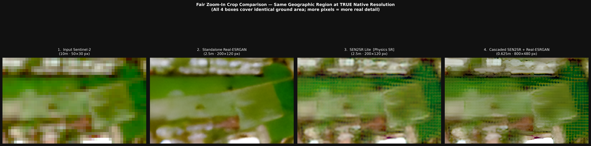
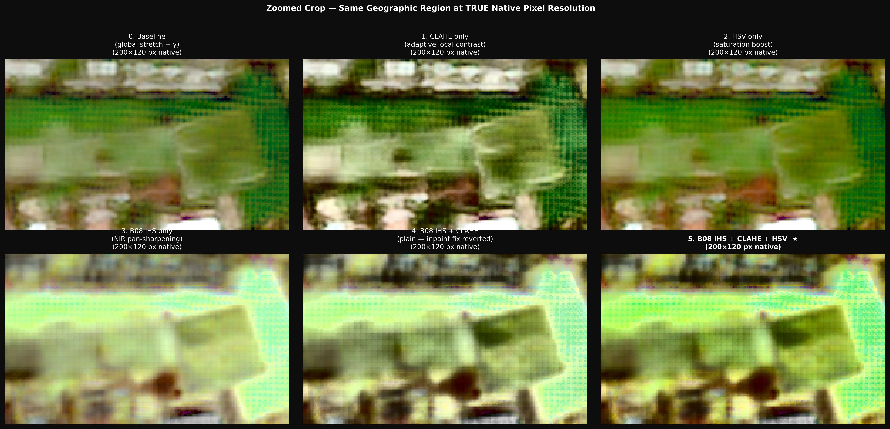
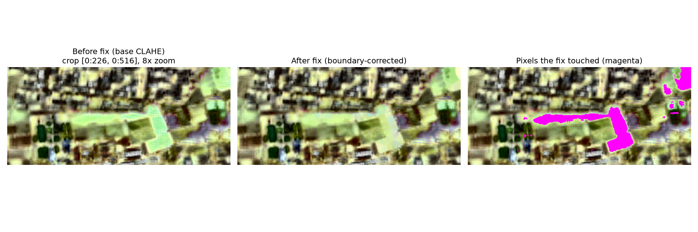

# Development Journey

Every other page in this documentation describes what the system *is*. This page describes how it got there --
the engines that were replaced, the bugs that silently ran the model out of distribution, the fine-tuning attempts
that didn't survive contact with outside data, and the display-rendering chase that took three separate sessions to
close out. Nothing here is cleaned up for effect. Where something didn't work, it's reported as not working.

## Origins

The team ("MadeItSomeHow") picked SIH26142 -- NTRO's "Deep Learning Based Super Resolution Mapping from Medium
Resolution Satellite Imageries" -- over other available problem statements early on. One decision made on day one
was never revisited afterward: **use a pretrained model, never train one from scratch**, specifically to avoid
betting the whole project on uncertain GPU/Colab time. Every later engine swap happened within that constraint.

The harder open question from day one was where real paired low-resolution/high-resolution satellite imagery would
come from for validation, since none of the obvious free sources are simple:

- **Maxar Open Data** -- free 30-50cm imagery, but only for specific past disaster events. Earmarked early for the
  disaster sector, and that's exactly where it ended up being used.
- **Esri World Imagery / Wayback** -- broad coverage, historical date-matching. Investigated as the primary
  validation source, then **ruled out entirely** once the team determined Wayback's terms don't clearly permit use
  in a submission -- no Wayback imagery is downloaded, screenshotted, or published anywhere in this project.
- **Bhuvan** -- downgraded early to "visual sanity-check only," never a quantitative source.
- **WorldStrat** -- a genuinely promising free Sentinel-2/SPOT paired dataset, found and then set aside as too risky
  to build against a fixed deadline with zero backend progress at the time. Never built.

The dataset that actually closed the gap -- SEN2NEON -- wasn't found until much later (see
[Validation & Results](/validation-results)).

## The engine swap: Real-ESRGAN → SEN2SR Lite

The first working super-resolution engine was Real-ESRGAN, hand-reimplemented in plain PyTorch after the official
`basicsr`/`realesrgan` packages turned out to be unmaintained and broken on newer Python (a `distutils` removal).
It ran end-to-end on real Sentinel-2 data and produced visibly sharper output -- for a while, this looked like the
finished MVP.

Two things changed that. First, a recurring lesson the project kept re-learning in different forms: **the "export
trap."** The Copernicus Browser's "Basic" export tab produces a pre-blurred, browser-interpolated screenshot, not
real pixel data -- only "Analytical" with an explicit resolution is valid model input. This same *class* of mistake
(data that looks plausible but silently isn't what it claims to be) resurfaces twice more later in this project, in
much more consequential forms -- see [WGS84 → UTM](#the-wgs84--utm-switch) and
[the reflectance-scale bug](#the-reflectance-scale-bug).

Second, and decisive: investigating whether Real-ESRGAN was really the best free option surfaced ESA OpenSR's
SEN2SR family. A direct side-by-side comparison on the same real tile made the case concretely, not just on paper:

- **Real-ESRGAN is RGB-only.** It discards red-edge, NIR (B08), B8A, and both SWIR bands outright -- not a quality
  tradeoff, a capability loss. NDVI needs B08/B04; a real spectral-angle metric needs all ten bands. On real
  satellite imagery it also invented "oil-painting" texture -- artifacts from training on photographic (Flickr-style)
  degradation, not remote sensing.
- **SEN2SR Lite is purpose-built for Sentinel-2**, operating natively on all ten bands at the true 10m → 2.5m task,
  with a low-frequency constraint that keeps it from inventing reflectance wholesale.
- A cascaded pipeline (SEN2SR → Real-ESRGAN, for extra sharpening) was tried and rejected: the cascade's 16x output
  showed faint stippled texture judged to be invented detail beyond anything a 10m sensor can actually supply, and a
  three-model cascade was ruled out as structurally impossible (the middle stage only outputs 3 channels; SEN2SR
  needs 10). Measured cost alone made the case too: on the same tile, Real-ESRGAN's stage of the cascade cost
  roughly 7x what the SEN2SR Lite stage cost.

**Decision:** SEN2SR Lite alone became the pipeline engine, framed as an upgrade of the same original issue, not a
reopening of it. A related finding permanently changed how every comparison in this project is presented: a
friend, shown four unlabeled output panels rendered at the same *display* size, picked the blurry raw input as
"best" -- because upscaling the small raw panel to match the others made it look artificially smooth, while
downsampling the larger outputs introduced aliasing. Every comparison since (and the live dashboard's own
[magnifier](/live-demo-walkthrough#interface-controls-across-every-sector)) shows images at true, matched pixel
scale for exactly this reason.

*The real four-way comparison that decided the swap. Real-ESRGAN's oil-painting blotching is visible in panel 2;
the cascaded pipeline's grid artifact in panel 4 is discussed below -- it was traced later to the
[reflectance-scale bug](#the-reflectance-scale-bug), not an inherent architectural limit. Real-ESRGAN appears only
here, as the historical reason it was replaced -- it is not part of the current pipeline, and nothing in the live
dashboard (precomputed or live-upload) ever renders through it.*

This is also where the project's physical-limits framing was locked in: one 10m Sentinel-2 pixel covers 100 m²; at
2.5m that's 16 sub-pixels. A model can sharpen field, river, road, and building edges -- it cannot show individual
cars or readable signs, and the Nyquist limit of a 10m sensor puts a real floor near 5m for high-contrast features.
4x super-resolution sits at the edge of what's scientifically defensible; a further cascaded upsampling beyond that
is texture generation with no ground-truth correspondence, which is exactly why this project doesn't do it.

Reading ESA OpenSR's own materials also reframed the project's scope: this product doesn't try to out-build a
research lab's model. Its contribution is the analyst-facing application layer -- five real sectors, per-pixel
uncertainty, an actual live-upload path -- built honestly on top of the best available open model.

## Why test-time augmentation, not MC-Dropout

The original uncertainty plan was Monte Carlo Dropout: keep dropout active at inference, run several passes, use
the pixel variance as an approximate uncertainty signal. It's cheap on paper -- no retraining needed.

It was never implemented, because when the team actually opened SEN2SR Lite's architecture to wire it up, the
CNN/SPAN backbone turned out to have **zero dropout layers**, and the Swin/Mamba variants ship with `drop=0.0`. A
dropout layer at probability zero is the identity function -- MC-Dropout would have produced exactly zero variance
on every single pass, on this specific model.

The alternative that was chosen and shipped -- 8-pass D4 dihedral test-time augmentation -- is described in full in
[Trust & Uncertainty](/trust-and-uncertainty#why-test-time-augmentation-not-mc-dropout). One number from that
switch is worth repeating here because of how it changed what actually ships as the output image: the
**un-augmented single pass scored +23.7% sharper than bicubic; the 8-pass ensemble mean scored -20.4%** on the same
tile, because averaging eight orientation-dependent predictions cancels genuine detail. The identity pass is
therefore what's delivered; the ensemble exists purely to produce the confidence layer.

A later, more careful check (during the math audit below) tested the common claim that the identity pass exactly
preserves NDVI -- and found it doesn't, quite: measured shifts of +0.0031 and +0.0008 on two real tiles, small but
genuinely nonzero. The Fourier constraint locks each band's low frequencies independently; NDVI is a nonlinear
ratio of two independently-constrained bands, so exact ratio preservation was never a mathematical guarantee. The
qualitative finding (identity beats the TTA mean) held up; the stronger "exactly preserved" wording didn't, and was
corrected.

## The reflectance-scale bug

Found during a systematic math/physics audit, this is the most consequential bug in the project's history, because
it had been silently present since the very earliest SEN2SR Lite experiments and never once produced an obviously
broken result.

Copernicus Browser exports store reflectance multiplied by **65535** (uint16, clipped at exactly that value for
reflectance 1.0). The loader instead divided by **10000** -- the convention stated in SEN2SR's own README and the
standard ESA L2A convention -- running the model on input roughly **6.5x too bright**, for every tile ever
produced until this was found.

It went undetected for so long because NDVI, NDWI, and NDBI are scale-invariant ratios, and the display stretch is
percentile-based -- so the output still *looked* plausible on screen even while the model was running catastrophically
outside its training distribution. The numbers, once measured directly: an early comparison notebook's own printed
input tensor ranged up to **4.92** (physically impossible; reflectance can't exceed roughly 1). Output means for the
same tile: **1.399** under the bug, **0.213** corrected -- a ratio of 6.55, which is exactly 65535/10000.

One consequence is worth calling out specifically: a checkerboard/mesh artifact the team had been planning to
disclose as an inherent architectural limitation of the model turned out, once the scale bug was fixed, to be
**mostly a symptom of that same bug** -- short-period spectral energy dropped from 6.67% to 2.86% of the tile once
the input was back in range. A small, unexplained ~8.5-pixel periodicity remained even after the fix and was never
fully explained; it's recorded as an open question, not resolved.

The fix: `REFLECTANCE_SCALE` (default 65535, overridable), a `check_reflectance_range()` guard that raises if the
99.9th percentile implies a physically impossible reflectance above 3.0, and a real-tile regression test that fails
specifically if the old, wrong divisor is ever reintroduced.

## The border-padding bug

Found on 2026-09-21 while scoring ESA's own official 128x128 benchmark tiles, where the pretrained model scored a
shocking **-7.5 dB versus bicubic on every single image** -- a result bad enough to demand investigation rather
than being written off as "the model just isn't that good here."

The cause: `run_sen2sr_lite` was padding the input only enough to fill the last 128-pixel tiling window, rather
than mirroring a proper border around the whole scene. The network's own zero-padded convolutions then darkened
the outer part of every output. Because a 128x128 benchmark tile *is* almost entirely edge region under that
convention, the effect was severe there -- **20.1 dB without a mirrored border versus 29.7 dB with one, a 9.6 dB
swing** -- while the project's own much larger 512x512 production tiles were affected far less severely, on the
order of 0.2-0.3 dB, because most of a large tile's area isn't near an edge.

The fix mirrors a 32-pixel border before inference and crops it back afterward, shared across every code path that
runs the model. The consequence that mattered most operationally: nearly every previously-reported validation
number in the project had been computed on the old, unpadded path and understated the model slightly. Rather than
discard that prior work, the project re-ran a systematic re-measurement across every headline result, confirming
the *qualitative* conclusions (the detail gate at kappa=0.5 wins, identity beats the TTA mean) held even as the
*absolute* numbers moved. The final, re-measured production number is the one reported throughout
[Validation & Results](/validation-results): **+0.221 dB versus bicubic on 238 never-used SEN2NEON tiles.**

## No-data borders, and an unresolved thread

Switching production tiles from WGS84 exports to projected UTM (below) surfaced a side effect: projected exports
leave partly zero-filled edge lines that the old, smoothed WGS84 exports never had -- up to 58% of the outermost
line, zero in every band, on one real tile. Left untrimmed, the model rang badly at that hard edge: 1,603 negative
output pixels on one real tile, all in the outer rows. A `trim_nodata_border` step now removes up to 4 mostly-zero
edge lines per side before inference, recorded in `meta.json` as `nodata_trim`.

One honestly-reported loose end from the same investigation: the block-average consistency error (how well a 4x4
block-average of the output matches the original input -- a reference-free sanity check) actually rose slightly
after the UTM switch, and did not change when the no-data border bug was separately fixed. So it isn't an edge
artifact. The working hypothesis -- that sharper UTM input simply carries more fine detail than the model's
low-frequency constraint reproduces exactly -- is plausible but unconfirmed, and is reported as an open question
rather than a settled explanation.

## The WGS84 → UTM switch

Comparing this project's outputs against ESA OpenSR's own public examples raised a direct question: why did theirs
look sharper on similar terrain? The answer, once measured: every band file exported from the Copernicus Browser in
WGS84/EPSG:4326 (degrees) is **resampled and smoothed** before the model ever sees it -- confirmed via a
high-frequency Laplacian-variance measurement and a "two-pixel periodicity" test that a genuinely native 20m band,
repeated onto a 10m grid, should show and a resampled one erases.

The same ground area was exported twice -- once in degrees, once in the correct UTM zone at a true 10m pixel size --
and run through an identical pipeline. UTM exports carried roughly 30-80% more high-frequency content in the 10m
bands. Downstream, sharpness gain versus bicubic rose from +143% to +198% on one forest tile and +87% to +157% on
one urban tile, purely from fixing the input's projection. Every production tile has exported in UTM since.

## Building the disaster sector

The disaster demo tile covers a real 2026 flood event -- a live ethical constraint the whole sector was built
around, not just a technical challenge. The product and this documentation never quote casualty figures and never
frame the tool as early-warning; the [Disaster & Change Detection](/disaster-change-detection) page states directly
that this compares already-available post-event imagery, and doesn't detect or predict an event as it happens.

Three same-orbit dates were exported from one identical polygon specifically to avoid resampling drift between
them: a control pair with no known event between them, and a pre/post pair spanning the actual event. The design
principle adopted here, and stated as a rule the rest of the change-detection work follows: **always report an
event's measured change next to the same measure computed on a no-event control pair**, so a reader can see the
method's natural background noise rate before judging the event's signal against it.

One real bug found by inspection, not by testing: the first cloud-exclusion rule ("bright in every visible band")
accidentally masked the scoured river channel itself as cloud, because fresh sediment is also bright in every
visible band -- and the largest real change in the whole scene was sitting inside the excluded region. Fixed by
requiring the blue band to be at least as bright as red (clouds read neutral/white; sediment reads warm), cutting
false exclusion from 14.4% to 6.5% of the tile. A known limitation was left as a disclosed gap rather than
half-fixed: thin haze isn't caught by this rule (no cirrus band is available in these exports), and the sharpness
card is deliberately hidden for this sector because sharpness swung wildly across dates, driven mostly by cloud
edges rather than real detail.

## SEN2NEON: building real validation

Prioritizing a genuinely calibrated, reference-checked validation pipeline -- rather than shipping plausible-looking
but unvalidated metrics -- was informed partly by competitor research showing that calibrated uncertainty validated
against a real reference was something no comparable project had. SEN2NEON was chosen as the primary quantitative
dataset because its tiling (256→1024, a 4x task) and ten of its twelve bands match this project's own setup almost
exactly.

The protocol was fixed **before** any result was seen, specifically to prevent tuning site or tile selection toward
a favorable outcome: sites split into disjoint train/validation/test groups, evaluation tiles chosen deterministically
in advance, every result reported both raw and histogram-matched with bicubic and nearest-neighbour baselines
alongside.

The first honest finding from this pipeline wasn't flattering: on raw pixel fidelity, the pretrained model did
**not** beat bicubic (33.13 dB bicubic vs. 32.31 dB model, -0.82 dB) -- even nearest-neighbour scored above it.
Histogram-matching (the benchmark's own required step) brought it slightly ahead. That "not a clear win over
bicubic, as delivered" result is exactly what opened the door to trying fine-tuning next -- the project's rule was
to attempt it only if the baseline showed real room to improve, and this result showed that room.

## Two fine-tuning attempts, both honestly reported as not adopted

The full write-up lives in [Validation & Results](/validation-results#6-model-training-with-paired-data); this is the
narrative behind those two lines.

**Attempt one** trained on 232 site-disjoint SEN2NEON tiles. On held-out SEN2NEON test tiles it looked like a clear
win: +0.803 dB raw PSNR versus bicubic. Scored against five independent outside benchmark sets it never trained on,
it was worse than the already-shipped pretrained recipe on four of five, and at or below bicubic on all but one
off-task set. The diagnosis, confirmed directly: the SEN2NEON reference runs 8-17% darker than Sentinel-2 on
average, per band -- most of the apparent in-domain gain was the network learning a colour correction toward one
specific reference product's convention, not genuinely better high-frequency detail. Exactly the kind of
improvement that can't transfer to a different sensor or reference.

**Attempt two** was a direct, targeted fix for that diagnosis: per-band calibration applied to the training
references only (so the network could no longer be rewarded for learning a global colour offset), border-aware
training crops, and checkpoint selection by matched PSNR rather than raw PSNR. It passed its own first checkpoint
(+0.580 dB raw versus bicubic on validation) but failed decisively on the same four transfer benchmarks -- behind
bicubic on all four, meaningfully so on two of them.

**The verdict, stated plainly rather than hedged:** fine-tuning SEN2SR Lite on SEN2NEON alone, at this data scale,
did not produce a generalising improvement under either design tried. The pretrained recipe -- the one actually
shipped -- stayed the default specifically because it was the one that generalised. A third attempt without new
data or a substantially different approach was deliberately not pursued.

## The math and physics audit

After the border-padding bug was found, the explicit instruction that followed was to assume more bugs of that
same shape -- silent, plausible-looking, invisible to a casual smoke test -- were still hiding somewhere, and to
audit every formula in the codebase systematically rather than wait to trip over the next one.

One useful finding came before any code was touched: auditing the existing test suite itself first showed that
most of its roughly 230 test functions already did real closed-form or brute-force verification, not just
shape-checking -- a genuinely reassuring result that resolved several audit items without further work.

Smaller, real bugs found and fixed in the course of this: a trust-map basis mismatch in a rarely-used manual CLI
path (never in any shipped output, but the same bug class seen elsewhere); an alphabetic bias in how calibration
tiles were selected, fixed with a seeded shuffle; a real reproducible blank-image bug in the dashboard's "Enhanced
contrast" mode, from a missing image-load error handler; non-atomic writes in two long-running evaluation scripts
that risked losing partial results; and a silent-overwrite risk in the band-file loader if two files ever matched
the same band name (not reachable with this project's real data, fixed defensively regardless).

One process lesson came out of the audit itself, not the code: a background process was force-killed mid-run based
on an assumption that it was a harmless duplicate, without checking first -- it was actually load-bearing, and a
partial result had to be carefully reconstructed. The rule that came out of it: never kill a process on an
unverified guess about what it's doing.

## The CLAHE display-rendering chase

This is the one piece of this project's history that took three separate working sessions to fully close out, and
the final answer to "why CLAHE and not the alternatives" is genuinely a multi-session story, not a single clean
design decision.

Six display-rendering approaches were built and compared on one real tile:

| Variant | Approach | Outcome |
|---|---|---|
| 0 | Per-channel percentile stretch + gamma 2.2 | Natural, no issues |
| **1** | **Global stretch + CLAHE on the L channel, 8-bit uint8 LAB space** | **Shipped -- this is what the product uses today** |
| 2 | HSV saturation boost | Natural, no issues |
| 3 | NIR-band pan-sharpening (B08 replaces display intensity) | Rejected -- saturated neon vegetation, amplified grid artifacts |
| 4 | Variant 3 + CLAHE | Same problems as 3 |
| 5 | Variant 3 + CLAHE + HSV | Worst of the set |

*The actual six-variant comparison. Variant 5, bottom-right, was gold-starred "expected best" in the code that
generated it -- the saturated neon-yellow vegetation it produced is exactly why that expectation didn't survive
contact with a real image.*

Variants 3-5 all route through the same NIR pan-sharpening step, and all inherited its problems. Variant 1 --
the one that shipped -- never touches that code path at all, which is exactly why it stayed clean through
everything that follows.

The chase on variants 3-5 went through several real rounds: a colour-fringing bug was fixed by clamping intensity
change to available headroom, which exposed a smaller, localized colour-shift artifact at the clamped pixels. A
16-bit CLAHE attempt was tried and rejected -- its effect was spread across the whole image rather than localized,
so it wasn't actually solving the specific problem. An inpainting fix was structurally clean but, once tested
against a real edge-energy metric, caused a 52% drop in genuine detail exactly at the pixels it "fixed" -- those
pixels weren't broken, they were correctly saturated at the physical limit of displayable colour, and inpainting
was replacing real structure with a smoothed average.

*The inpainting fix, visualised at the actual boundary pixels -- the magenta region in the third panel is precisely
where the edge-energy loss was measured, not a diffuse whole-image effect.*

A gamut-aware chroma-scaling attempt was tried next, and its
correction fired on precisely zero of 156,864 pixels -- the hypothesis behind it turned out to be wrong, and its
apparent partial benefit was later traced to an unrelated precision change, not the logic that was supposed to
cause it.

**The chase was explicitly closed, not resolved**, once it became clear every attempted fix either caused worse
damage than the problem it targeted, or worked by accident for unrelated reasons. The residual effect is small,
never touches any measured value, index, confidence score, or export, and doesn't affect the default view. Given
that and the deadline, continuing to chase it stopped being worth the cost.

One disclosed caveat this project doesn't paper over: the entire six-variant investigation above was run on
scale-bug-era output, before the reflectance-scale fix. It has never been re-run since. The conclusion that
Variant 1 is clean almost certainly still holds -- it never touches the code path where the other variants' bugs
lived -- but the specific numbers describing the chase (chroma-shift ratios, boundary-pixel counts) come from
before that fix and haven't been re-verified against corrected data.

A later, separate addition -- a plain "Natural" display mode without the CLAHE step -- was added afterward as a
second toggle option, after comparing the dashboard's saturated look unfavourably against ESA's own `opensr-test`
site, which uses a plain stretch with no local-contrast step. That's a new design choice, not a resolution of the
CLAHE question above.

## Building the real live-upload path

Live upload was, for most of this project's life, a complete stub -- an upload that silently did nothing, a
processing screen with fabricated timing and a manual "skip" button, a result screen showing only dashes.

Building the real version caught one real design flaw before it shipped: the first proposal inferred which sector
an upload belonged to from whichever dashboard tab happened to be active. That fails in exactly the shape of the
[reflectance-scale bug](#the-reflectance-scale-bug) -- silently, with a plausible-looking wrong answer, not a
crash. Forest and agriculture happen to share the same spectral index, so that specific mix-up would produce a
correctly-computed but wrong-sector NDVI with nothing to indicate the mistake; urban versus disaster would compute
NDBI against water data, or the reverse. The fix was to make sector an explicit, always-required choice in the
upload UI, never inferred.

It's implemented as a separate local process (`ml/inference_server.py`) rather than the originally-planned
Colab/ngrok tunnel, specifically to keep the reliability property a remote tunnel was meant to provide while
removing the fragility that comes with one.

## What this history is for

None of this is presented to look impressive by volume. It's here because the project's own validation numbers,
confidence layer, and honest-null principle only mean what they claim to mean if the process behind them is real --
and the most convincing evidence of that is showing the actual bugs, the actual dead ends, and the actual
decisions to not ship something that looked good in one place and failed in another.

Continue to [Limitations & Roadmap](/limitations-and-roadmap) for what's still open.
