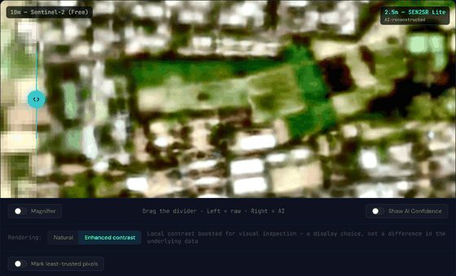
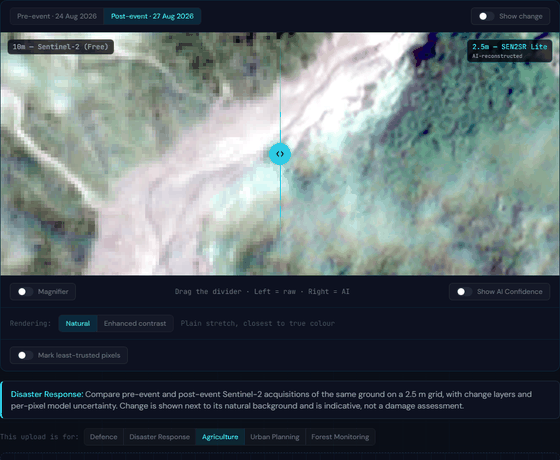
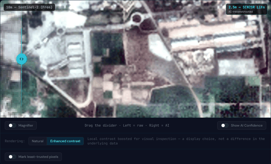
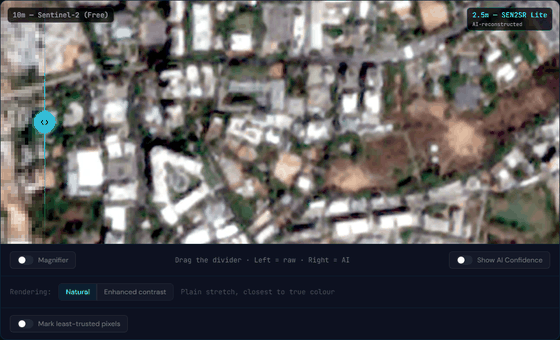
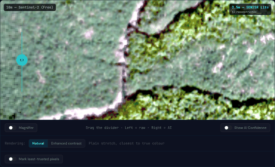
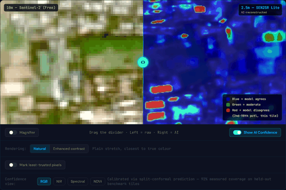
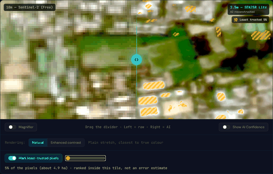
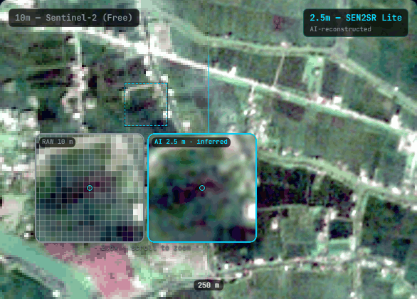
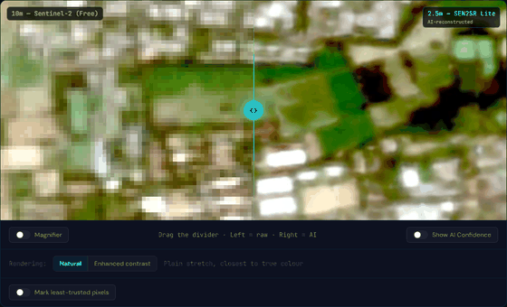
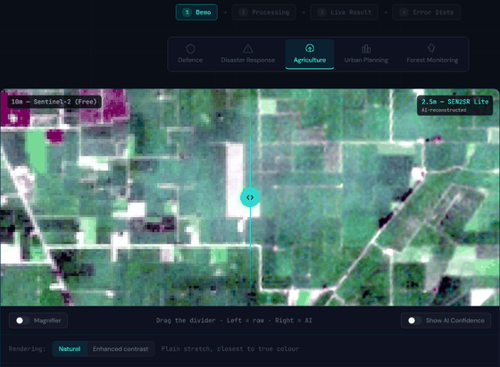

# Live Demo Walkthrough

Five sectors, each running the real pipeline against real Copernicus tiles on their native UTM grid, plus a live
upload path that runs the same audited pipeline on-demand.

## Agriculture

NDVI (vegetation vigour). The before/after slider compares the raw 10 m Sentinel-2 render against the 2.5 m
super-resolved output; the confidence overlay shows per-pixel model agreement across the 8 TTA passes.

## Disaster Response

NDWI (open water / flooding). The one sector with a genuine before/after **event**: a real 2026 flood, with change
layers measured against a no-event control pair on an identical grid -- see
[Disaster & Change Detection](/disaster-change-detection) for the full methodology.

## Defence

NDVI. Terrain and vegetation monitoring at the resolution where narrow features (roads, field boundaries) start to
separate from noise.

## Urban Planning

NDBI (built-up surface). Small structures and road networks that are effectively invisible at 10 m become
distinguishable at 2.5 m.

## Forest Monitoring

NDVI. Canopy-level detail for a use case where the input resolution most directly limits what's visible.

## Interface controls, across every sector

**Show AI Confidence** toggles the uncertainty overlay, with a picker for RGB / NIR / Spectral / Index views (the
last labelled NDVI, NDWI, or NDBI to match the sector).

**Mark least-trusted pixels** overlays the bottom N% most-distrusted pixels in the tile with an amber stripe, driven
by a percentage slider.

**Magnifier** shows twin hover lenses: the raw 10 m input on the left, drawn as true pixels (nearest-neighbour, with
a faint grid once one source pixel spans enough screen pixels to show it honestly), and the AI output on the right,
both centred on the same point.

**Natural / Enhanced contrast** is a display-only toggle (percentile stretch vs. local-contrast CLAHE); it never
changes the underlying data, so nothing looks more edited than it is.

## Try it yourself: live upload

Unlike the five precomputed sectors above, live upload runs real inference on demand. Click **"Download a real
sample"** next to the upload zone to get an actual 10-band tile, then drop it back in, pick which sector it's for
(explicit, never inferred from whichever tab happens to be open -- the sector picks the spectral index formula, so a
silent guess could quietly compute the wrong one), and watch it process.

No TTA runs on a live upload by default on CPU (single pass, to stay fast); the server auto-detects a GPU and runs
the full 8-pass ensemble there instead. See [Architecture](/architecture) for why.
